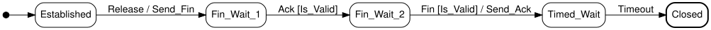

# SML

Declarative, low-overhead **state machines for Ada**, inspired by
[boost-ext/sml](https://github.com/boost-ext/sml). The goal is to describe a
machine as a table you can read top-to-bottom — the way a UML state chart reads —
while keeping the engine small, fast, and provable.

The example (`example/hello_world.adb`, a port of Boost.SML's TCP-teardown
example) is exactly this diagram:



```ada
--  Each row reads:  From + Event (Guard) / Action >= To
Table : constant Transition_Table :=
  [Established + Release            / Send_Fin >= Fin_Wait_1,
   Fin_Wait_1  + Ack     (Is_Valid)            >= Fin_Wait_2,
   Fin_Wait_2  + Fin     (Is_Valid) / Send_Ack >= Timed_Wait,
   Timed_Wait  + Timeout                       >= Closed];
```

## Why this design

You can't reproduce Boost.SML's `src + event[guard] / action = dst` operator DSL
exactly in Ada (`=` must return `Boolean`, there is no user-definable `[]`, and
operator symbols are a fixed set) — but `Sml.Machines.Operators` gets close
with `+`, `(...)`, `/` and `>=`, because the *at-a-glance* quality of SML lives in the
row layout, not the exact operators. States and events are enumeration types,
transitions are a flat array (one row each), and guards and actions are **named**
rather than stored as subprogram pointers. Naming them keeps the table pure
data, lets the compiler inline the dispatch, makes the `case` arms
exhaustiveness-checked, and keeps the engine provable with SPARK.

`Sml.Machines` is the engine; `Sml.Machines.Operators` is the opt-in
operator layer that produces the rows above. The core operation is
`Process_Event` (matching Boost.SML's `process_event`).

## Compared to Boost.SML

Boost.SML packs everything into one ~3,400-line header via template
metaprogramming. This library keeps a **~140-line provable core engine** and
moves each extra capability into a small **opt-in layer** (each ~15–80 lines),
so you pay only for what you instantiate. The whole library is ~370 lines.

| Capability | Boost.SML | This library |
|---|---|---|
| Declarative transition DSL | `src + event[guard] / action = dst` | `From + Event (Guard) / Action >= To` (`Sml.Machines.Operators`) |
| Named guards & actions | functor objects | enum-dispatched, so the table stays pure data and the engine inlines |
| Events with payloads | ✓ | ✓ (variant record); or `Sml.Simple_Machines` for no-payload events |
| Extended state | dependency injection | a `Context` record passed to guards/actions (or bundled into the machine via `Sml.Machines.Bundled`) |
| Completeness / unhandled policy | `process_event` returns handled; custom unexpected handling | `Total`/`Partial` check + `Stay`/`Raise_Error`/`Go_To_Default` |
| Logging | `logger` policy | four structured `On_Event`/`On_Guard`/`On_Action`/`On_Unhandled` hooks |
| Orthogonal regions | ✓ native (heterogeneous) | `Sml.Machines.Regions` for identical replicas; heterogeneous regions composed by hand |
| Composite / hierarchical states | ✓ native sub-machines | `Sml.Machines.Composite` (child-first dispatch, bubbles to parent) |
| Deferred events | `defer` | `Sml.Machines.Deferring` (bounded queue) |
| Internal / run-to-completion events | `process` / internal transitions | `Sml.Machines.Reactive` (entry-event chaining, bounded by `Max_Steps`; reports `Settled` vs `Step_Limit_Reached`) |
| `on_entry` / `on_exit` | ✓ native | entry events via `Reactive`; no dedicated exit actions |
| History pseudostates | ✗ | ✗ |
| Compile-time, low overhead | ✓ (header metaprogramming) | ✓ (generics; an instantiated machine inlines to a jump table at `-O3`) |
| Code generation | ✗ | not shipped — feasible as an add-on (text spec → enums + `case` dispatch; see note below) |
| Formal verification | ✗ | ✓ SPARK: AoRTE + contracts, `gnatprove --checks-as-errors=on` |

The trade: Boost.SML offers richer *native* orthogonal regions and entry/exit
actions in a single header; this library offers a tiny formally-verified core
and an a-la-carte feature set — at the cost of composing the
heterogeneous-region and entry/exit cases yourself.

## Operator notation

Instantiate the `Sml.Machines.Operators` child on your `Machines` instance,
naming the "always" guard and "do nothing" action used by rows that omit them:

```ada
package SM is new Sml.Machines (...);
package Op is new SM.Operators (Always => Always, Nothing => Nothing);
use SM, Op;

Release : constant Ev := (Kind => E_Release);   --  one wrapper per event
--  Ack, Fin, Timeout : likewise
```

A row built this way is just a `Transition`, so the table is an ordinary array
aggregate fed to the usual `Make` — no special container, and it stays in the
SPARK subset. (The engine also accepts plain tuple rows
`(Established, Release, Always, Send_Fin, Fin_Wait_1)` without these operators —
that's what the tests use.) Costs: a wrapper constant per event (its name
must differ from the `Event_Kind` literal, hence the `E_*` prefix), and `>=`
rather than SML's `=` for the target. The initial state is given to `Make`
(SML's `*`); a state with no outgoing row is terminal (SML's `X`).

### Guards & actions

`Guard_Kind` and `Action_Kind` are your own enumerations; you supply one
`Evaluate` and one `Execute` dispatcher mapping a name to its behaviour:

```ada
function Evaluate (G : Guard_Kind; Ctx : Context; Evt : Event) return Boolean is
  (case G is
      when Always   => True,
      when Is_Valid => ...);

procedure Execute (A : Action_Kind; Ctx : in out Context; Evt : Event);
```

`Context` is your *extended state* — whatever the guards read and the actions
modify (a counter, a buffer, …). Guards are read-only (`Ctx` is `in`); actions
may modify it (`in out`).

### Events with payloads

Events are a variant record; `Kind_Of` extracts the discrete tag the table
matches on:

```ada
type Event (Kind : Event_Kind := E_Timeout) is record
   case Kind is
      when E_Ack  => Ack_Valid : Boolean;
      when E_Fin  => Id : Integer; Fin_Valid : Boolean;
      when others => null;
   end case;
end record;
```

### No-payload machines

If your events carry no data, skip the variant record and `Kind_Of` entirely:
instantiate `Sml.Simple_Machines` with the event enumeration directly. It
re-exports the same `Machine`, `Transition_Table`, `Make` and `Process_Event`
(with the same SPARK contracts) — there's just less to write:

```ada
package M is new Sml.Simple_Machines
  (State, Event, Context, Guard_Kind, Action_Kind, Evaluate, Execute);
use M;

Table : constant Transition_Table :=
  [(Locked,   Coin, Always, Take_Coin, Unlocked),
   (Unlocked, Push, Always, Nothing,   Locked)];
```

Here `Evaluate`/`Execute` receive the event *kind* directly (there's no payload
to carry). See `example/simple_turnstile.adb`.

### Orthogonal regions

Orthogonal regions are one object that is *simultaneously* in several
**different** concurrent regions — a media player at once in a playback region
`{Stopped/Playing/Paused}` and a volume region `{Normal/Muted}`. Each is its own
machine, every event is offered to all of them (each ignores what it doesn't
own), and the object's state is the *combination*; because the regions differ
you dispatch to each by hand — see `example/orthogonal_regions.adb`.

For the homogeneous case — N *identical* replicas of one machine —
`Sml.Machines.Regions` broadcasts one event to an array of machines against a
shared `Context`:

```ada
package Reg is new SM.Regions (Count => Table'Length);
R : Reg.Region_Array :=
  [Make (Table, Off), Make (Table, On), Make (Table, Off)];

Reg.Broadcast (R, Ctx, Tick);             --  every region steps
pragma Assert (Reg.All_In (R, Off) = False);
```

Each region keeps its own state; `Count` fixes the shared table length (a
`Machine` is discriminated by it). Heterogeneous regions — genuinely different
machines — are composed by hand: just call each one's `Process_Event`. See
`example/orthogonal_regions.adb`.

### Run-to-completion (internal events)

A state can settle itself by emitting an event on entry — a `Dialing` state that
immediately sends `Connect`. `Sml.Machines.Reactive` feeds the outside event,
then keeps processing each entered state's entry event until one settles with
none:

```ada
package RC is new SM.Reactive
  (Has_Entry_Event => Has_Entry_Event, Entry_Event => Entry_Event);

RC.Run_To_Completion (M, Ctx, Dial);   --  Idle -> Dialing -> Connected
```

The chain is bounded by `Max_Steps` (default 16), so a cyclic configuration
stops instead of looping forever — which is also how SPARK proves it terminates.
Unlike Boost.SML (which runs internal transitions to true completion), that cap
can cut a chain short; a `Run_To_Completion` overload reports which happened:

```ada
Outcome : RC.Completion;
RC.Run_To_Completion (M, Ctx, Dial, Outcome);
--  Settled            -- reached a state with no (or a non-advancing) entry event
--  Step_Limit_Reached -- still advancing when Max_Steps was hit
```

A state whose entry event leaves it in place counts as `Settled` — the event
fires once, not `Max_Steps` times. See `example/run_to_completion.adb`.

### Deferred events

An event a state can't handle yet can be *deferred* — queued and re-tried after
the next handled event. `Sml.Machines.Deferring` holds a bounded queue (a
separate object that never touches the machine) and a `Deferred (State,
Event_Kind)` predicate deciding what to queue:

```ada
package Def is new SM.Deferring (Deferred => Deferred, Rebuild => Rebuild);
Q : Def.Deferral_Queue := Def.Empty_Queue;

Def.Post (M, Q, Ctx, Pause);   --  unhandled but deferred -> queued
Def.Post (M, Q, Ctx, Play);    --  handled -> the deferred Pause re-delivers
```

Because `Event` is indefinite, the queue stores event *kinds*; `Rebuild` turns a
kind back into an event for re-delivery (exact for payload-free machines).
`Capacity` bounds the queue (overflow raises `Deferral_Overflow`), which keeps it
SPARK-provable. It builds on a lower-level `Process_Event` overload that reports
whether an event was handled instead of applying the unhandled policy. See
`example/deferred_events.adb`.

### Composite (hierarchical) states

A state can contain a child machine: an event tries the child first and bubbles
up to the parent only if the child doesn't handle it. `Sml.Machines.Composite`
takes a `Process_Child` you wire to the child's handled-reporting
`Process_Event`, so the child can be a different machine (and you can pick a
different one per parent state); parent and child share the event and context
types.

```ada
procedure Process_Child
  (Ctx : in out Context; Evt : Event; Handled : out Boolean) is
begin
   Child_SM.Process_Event (Child, Ctx, Evt, Handled);
end Process_Child;

package Comp is new Parent_SM.Composite (Process_Child => Process_Child);
Comp.Process (Parent, Ctx, Evt);   --  child first, then parent
```

See `example/composite_states.adb`.

### Bundling the context into the machine

By default `Process_Event` takes the `Context` explicitly — which is exactly what
lets `Composite` and `Regions` share one context across several machines. If you
instead want a single, self-contained machine that *owns* its context (Boost.SML's
model, where the extended state is injected into the `sm` and `process_event`
takes only the event), instantiate `Sml.Machines.Bundled`:

```ada
package B is new SM.Bundled;
Obj : B.Instance := B.Make (Table, Initial => Idle);

B.Process_Event (Obj, (Kind => Go));   --  no Context argument
--  ... Obj.Ctx ...                     --  the extended state, read/written in place
```

`Instance` holds the machine and its `Context` together; both components stay
visible, so `Obj.Ctx` is read and written directly, just as an explicit context
would be. It's opt-in — the core engine still keeps `Context` external for the
shared-context cases — and `Instance` is limited only when your `Context` is. See
`example/bundled_context.adb`.

### Completeness & unhandled events

`Make` takes two policy knobs:

- `Complete => Total` makes `Make` reject a table that doesn't cover every
  `(State, Event_Kind)` (raising `Incomplete_Table`); `Partial` (default) allows
  gaps.
- `On_Unhandled` decides what `Process_Event` does when no row matches: `Stay`
  (default), `Raise_Error`, or `Go_To_Default`.

### Logging hooks

The engine takes four structured logging hooks — `On_Event`, `On_Guard`,
`On_Action`, `On_Unhandled` — and calls them with *scalars* (the event kind,
state, guard/action and result) as it runs. No message is ever built inside the
engine. Each hook defaults to a null procedure, so an instance that wants no
logging passes nothing and the calls vanish at every optimization level:

```ada
procedure On_Event (Evt : Event_Kind; From : State) is
begin
   if Trace_Config.Enabled then          --  gate it however you like
      Put_Line ("event " & Evt'Image & " in state " & From'Image);
   end if;
end On_Event;
--  ... On_Guard, On_Action, On_Unhandled likewise ...

package SM is new Sml.Machines (..., On_Event => On_Event, ...);
```

Because the hook is a real procedure, *you* decide the format, where it goes,
and when it's active — `hello_world_with_tracing` gates it on a static `Boolean`,
so a build with tracing off drops it entirely (the front end eliminates the
static branch, no optimizer needed). The plain `hello_world` omits the hooks; the
`debug` profile turns them on:

```console
$ make run-trace     # or: alr exec -- gprbuild -p -XMODE=debug -P example/example.gpr && ./example/bin/debug/hello_world_with_tracing
start: ESTABLISHED
[trace]event E_RELEASE in state ESTABLISHED
[trace]  guard ALWAYS => TRUE
[trace]  action SEND_FIN; ESTABLISHED -> FIN_WAIT_1
send: fin
...
final: CLOSED
```

### Formal verification (SPARK)

The engine is written in the SPARK subset. `proof/` instantiates the engine and
its operators for a turnstile and `gnatprove` verifies it: `Process_Event` is proved free of
run-time errors, and `Make`'s contract (`State_Of (Make'Result) = Initial`)
holds (`gnatprove` only analyses a generic through a concrete instance). `Make`'s
body is excluded from proof because its `Total`-completeness check raises
`Incomplete_Table` by design — that raise is part of its contract for callers.

## Generating a specialized machine (not shipped)

The table engine scans the transition table on every event — O(n) in the number
of transitions — and stores the table in each `Machine`. For hot paths this is
straightforward to sidestep by **generating** a specialized machine from a terse
text spec instead: parse rows written in the same operator notation as the Ada
table (`From + Event (Guard) / Action >= To`) into the `State`/`Event_Kind`
enums, then emit a `Process_Event` that is a `case` on the current state — an
O(1) jump table rather than a scan:

```ada
case M.Current is
   when Established =>
      if Evt.Kind = Release then
         Send_Fin (Ctx, Evt);
         M.Current := Fin_Wait_1;
         return;
      end if;
   --  ... one arm per state ...
end case;
```

Marked `Inline` and built at `-O3 -gnatn`, a whole-program driver over a
compile-time-known event sequence then constant-folds the machine away entirely
— the same shape as an optimized header-only Boost.SML `main` (just the action
side effects remain). The only hand-written Ada is what no table can imply: the
event payloads, the `Context`, and one inlinable subprogram per guard/action.

This repository does **not** ship such a generator; it is described here only as
a known, self-contained extension — a parser over the notation the Ada table
already uses — left out to keep the crate to its verified library core.

## Building, testing, proving, formatting

A `Makefile` wraps the common flows — each target just runs the underlying `alr`
command, and `make help` lists them all:

```console
make build     # build the library
make test      # build + run the AUnit suite
make prove     # run the SPARK proof
make run       # build the example (release: -O3, no tracing) and run hello_world
make format    # check formatting
```

The example builds in two profiles: `release` (`-O3`, tracing off, the default)
and `debug` (`-O0`, tracing on) — `make debug` / `make run-trace` use the latter.
Each profile builds on all cores (`-j0`) into its own `bin/<profile>` and
`obj/<profile>`, so switching profiles never needs a clean.

Transition tables are wrapped in `--!format off`/`--!format on` so `gnatformat`
keeps their hand-aligned columns.

## Requirements

GNAT + `gprbuild` (via Alire); the crate compiles as **Ada 2022**. The test
suite needs `aunit`; the proof needs `gnatprove`. The diagram in `docs/` is
rendered with Graphviz (`dot`).
